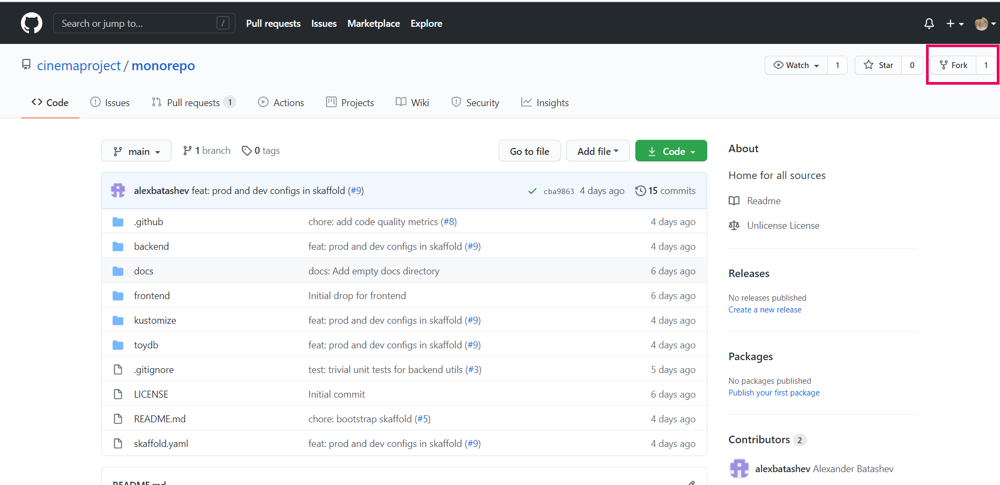
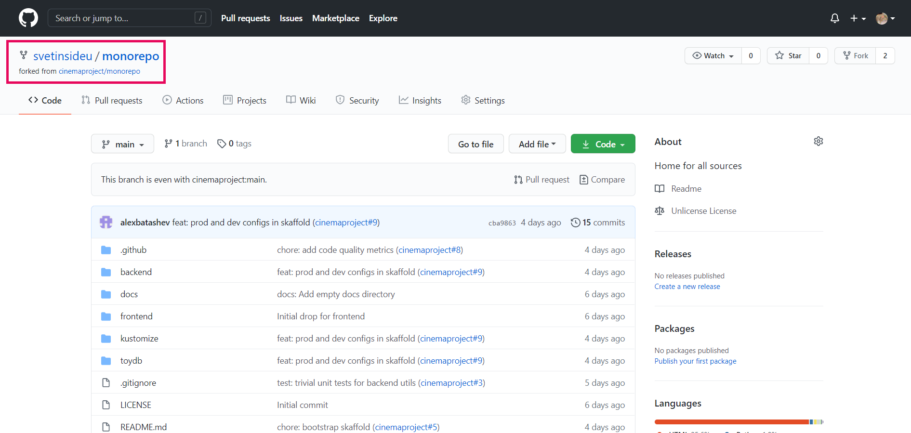

# Development Process

## 1. Fork the Repo

A fork is a copy of a repository. Forking a repository allows you to freely experiment with changes without affecting the original project. Once your code is ready, you can propose your changes by making a pull request.

1.  Sign in to your GitHub account and go to [https://github.com/cinemaproject/monorepo](https://github.com/cinemaproject/monorepo)
2.  In the top-right corner of the page, click **Fork**.


Now, you are in the copy of a repository. The path in the top-left corner changes from `cinemaproject/monorepo` to `<your username>/monorepo`. You can experiment here.



## 2. Clone the Repo

1.  Navigate to the working directory on your computer
2.  Open Git Bash
3.  Clone the repository with the following command:    
`git clone https://github.com/<your username>/monorepo`
4.  Press **Enter**
    
Now, you have a local copy of your fork of the repository.

## 3. Configure Git to Sync Your Fork with the Original Repo

1.  On your computer, navigate to the location of the fork you cloned
2.  Open Git Bash
3.  Choose the upstream repository for your fork with the following command:
`git remote add upstream https://github.com/cinemaproject/monorepo`
4.  To verify the new upstream repository you've specified for your fork, type `git remote -v`. You should see the URL for your fork as origin, and the URL for the original repository as upstream:
```
origin https://github.com/<your username>/monorepo (fetch)
origin https://github.com/<your username>/monorepo (push)
upstream https://github.com/cinemaproject/monorepo (fetch)
upstream https://github.com/cinemaproject/monorepo (push)
```

## 4. Create Your Branch and Make Changes

1.  Create a new branch and check it out with `git checkout -b <branch name>`
2.  Add the files to your commit with git add
-   To add all the files you have changed, use `git add .`
-   To add a particular file, use `git add <file name>`
3.  Commit your changes with `git commit -m "<your comment>"`. Comment must follow [conventional commits](https://www.conventionalcommits.org/en/v1.0.0/).
4.  Upload local repository content to a remote repository with `git push origin <your branch name>`
5.  Go to https://github.com/cinemaproject/monorepo and open a pull request. Title and description must follow [conventional commits](https://www.conventionalcommits.org/en/v1.0.0/)

## 5. Update your fork

1. Open Git Bash in you repository folder.
2. Do `git checkout main`
3. Do `git fetch upstream`
4. Do `git merge upstream/main`
5. Do `git push`
